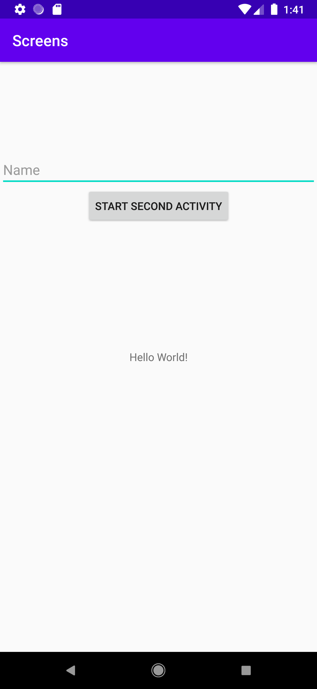
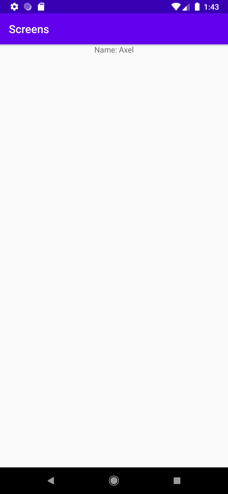

# Rapport

**Skriv din rapport här!**

Added a second activity by right-clicking on the same folder as MainActivity is in and selecting new,
activity, empty activity and named it SecondActivity.

Added a button in the layout file of the first activity, constrained it to parent. 
This button starts the second activity using the following code:
```
 <Button
        android:id="@+id/start_second_activity_button"
        android:layout_width="wrap_content"
        android:layout_height="wrap_content"
        android:onClick="startSecondActivity"
        android:text="Start Second Activity"
        app:layout_constraintBottom_toTopOf="@+id/textView"
        app:layout_constraintEnd_toEndOf="parent"
        app:layout_constraintStart_toStartOf="parent"
        app:layout_constraintTop_toTopOf="parent"/>
```
Also added an EditText widget in the same layout file, which lets the user enter their name. 

In the java code of the first activity I added a startSecondActivity() method. This method finds
the EditText widget with an ID of name_edittext, reads the text entered into a string and creates 
a new intent object. Lastly it adds the name value as an extra to the intent and starts the
SecondActivity. 

In order to display the name on the second activity, I added a TextView widget in the layout file
of the second activity using the following code:
```
    <TextView
        android:id="@+id/name_textview"
        android:layout_width="wrap_content"
        android:layout_height="wrap_content"
        android:text="Name: "
        app:layout_constraintBottom_toBottomOf="parent"
        app:layout_constraintEnd_toEndOf="parent"
        app:layout_constraintStart_toStartOf="parent"
        app:layout_constraintTop_toTopOf="parent" />
```
       
In the java code of the second activity the following code gets the data from the intent:
```
        Intent intent = getIntent();
        String name = intent.getStringExtra("name");
```

Then the TextView needs to be updated with the new data, which the following code does: 
```
        TextView nameTextView = findViewById(R.id.name_textview);
        nameTextView.setText("Name: " + name);
```
Screenshot of the first activity


Screenshot of the second activity. In this case the name input was Axel.
